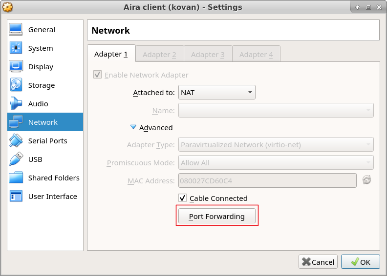

Connecting via SSH
==================

It is more convenient to work with virtual machine via ssh connection. In this section we will configure VM.

First, launch AIRA client and run a command:
```bash
$ git clone https://github.com/airalab/airapkgs -b nixos-unstable
```

Also we will need a tool to grab ssh key from Github:
```bash
$ git clone https://github.com/vourhey/github_authorized_key
```

Then edit `/etc/nixos/configuration.nix` and add following lines:
```
{
    ...

    services.openssh.enable = true;
    services.openssh.permitRootLogin = "without-password";
    services.openssh.authorizedKeysFiles = [ "/root/.ssh/github_authorized" ];

    ...
}
```

Make a rebuild replacing `/path/to/airapkgs` with real path:
```bash
$ nixos-rebuild switch -I nixpkgs=/path/to/airapkgs
```

Let's fetch a ssh key from Github, assuming you have at least one listed in your profile:
```bash
$ cd ~/github_authorized_key
$ ./main.py <github_login>
```

After this a `/root/.ssh/github_authorized` file will be created with your ssh public key.

Now it's time to configure a virtual machine. Go to machine settings, network, open Advanced and then Port Forwarding



Add a new rule:

Host IP   | Host Port | Guest IP  | Guest Port
--------- | --------- | --------- | ----------
127.0.1.1 | 2202      | 10.0.2.15 | 22

Now we are able to connect to AIRA client via ssh:
```bash
$ ssh -p 2202 root@127.0.1.1
```
