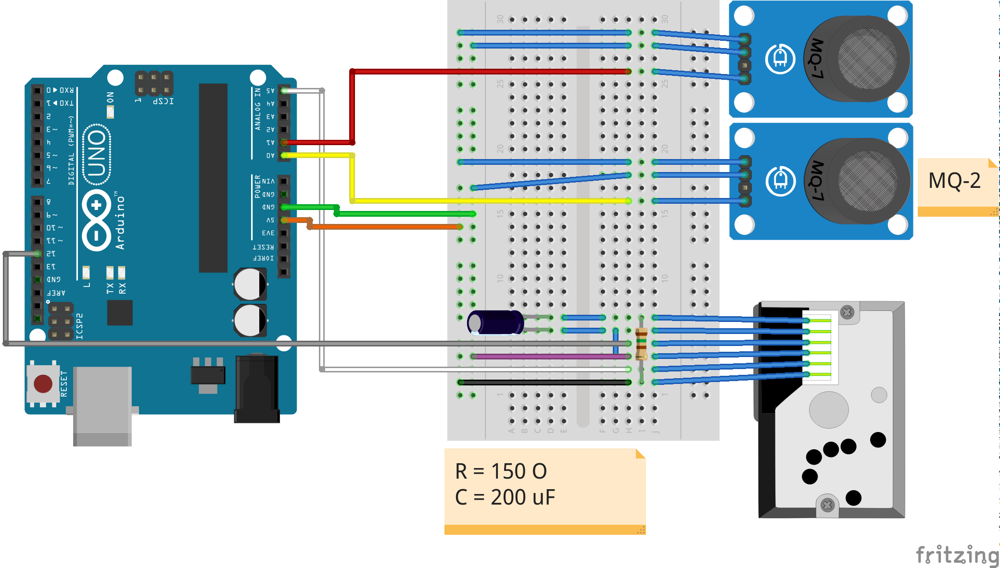
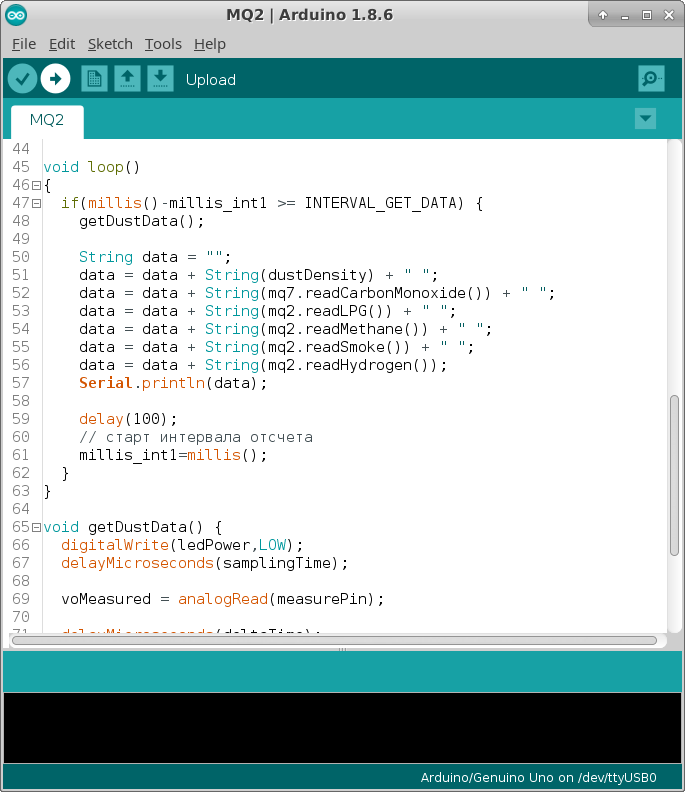
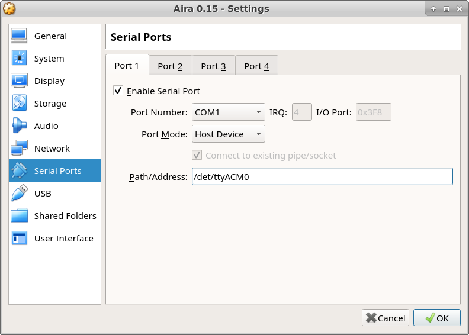

Connect an Air Pollution Sensor
===============================

In this lesson you are going to learn how to connect your sensor to the network and make it publish data. You will see how it is easy to become a member of a global sensor network!

.. note::

    Source code is located `here <https://github.com/airalab/robonomics_tutorials/tree/master/sensor_city>`_

In this section we are not going to create a liability contract. Instead we will teach Arduino with sensors to publish the data by a request. All measurements will be published as a Result message

Arduino
-------

Let's begin with an Arduino circuit. You need the following components:

* Arduino Uno
* Optical Dust Sensor Sharp GP2Y1010AU0F
* Gas Sensor MQ-2
* Gas Sensor MQ-7
* Resistor 150 Ohm
* Capacitor 220 uF
* Wires

Connect all parts as described below:

A firmware for Arduino Uno is in ``sensor_city/scetches`` folder. In order to upload it to the board use `Arduino IDE <https://www.arduino.cc/en/Main/Software>`_.

Aira
----

.. note::

    The following steps are performed in Aira client. You can download the latest image from `this page <https://github.com/airalab/aira/releases>`_.
    It's convenient to `connect via SSH <../aira_in_depth/Connecting_via_SSH.html>`_

After you have imported the image to VirtualBox, connect Arduino via USB to your PC and enable serial port forwarding.
You should check `Enable Serial Port` and assign ``/dev/ttyACM0`` in `Path/Address`. Inside the virtual machine ``/dev/ttyS0`` refers to your external Arduino.

Finally launch the image and run these command::

    $ roslaunch sensor_city publish_data.launch

.. hint::

  Check out the source code to learn how it works under the hood!

Now Aira patiently waits for a signal to publish the measurements. Go to `Dapp <https://dev.aira.life/smart-city/#/>`_ and click on `Broadcast signal`. You should see the data!
