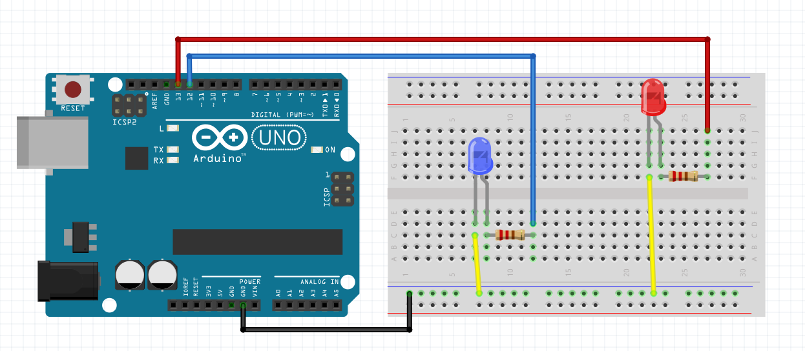

Passing Dynamic Parameters
==========================

In `previous <connect_simple_cps.html>`_ example we discussed how to create a simple CPS with Arduino. Our first CPS is able to do only one task: to blink a led. We suggest you to get through the first lesson. Now let's expand the example and teach our board to blink blue or red led depending on objective parameter.

.. note::

  The source code of this lesson is `here <https://github.com/airalab/robonomics_tutorials/tree/master/arduino_with_args>`_.

Arduino
-------

The only difference in Arduino source code is instead of subscribing to one topic now we subscribe to ``/blink_red`` and ``/blink_blue`` topics

.. code-block:: c

  #include <ros.h>
  #include <std_msgs/Empty.h>

  ros::NodeHandle nh;

  void blink(int led, int mil) {

    digitalWrite(led, HIGH);
    delay(mil);
    digitalWrite(led, LOW);
    delay(mil);

  }

  void blinkRedCb(const std_msgs::Empty& msg) {
    blink(13, 500);
    blink(13, 500);
    blink(13, 500);
  }

  void blinkBlueCb(const std_msgs::Empty& msg) {
    blink(12, 500);
    blink(12, 500);
    blink(12, 500);
  }

  ros::Subscriber<std_msgs::Empty> subRed("blink_red", &blinkRedCb);
  ros::Subscriber<std_msgs::Empty> subBlue("blink_blue", &blinkBlueCb);

  void setup()
  {
    pinMode(13, OUTPUT);
    pinMode(12, OUTPUT);

    nh.initNode();
    nh.subscribe(subRed);
    nh.subscribe(subBlue);
  }

  void loop()
  {
    nh.spinOnce();
    delay(1);
  }

Here is the diagram of all connections:

ROS
---

We can pass arguments via objective which points to rosbag file. Have a look at ``blink.py`` script. The main difference is ``blink()`` method:

.. code-block:: python

  ...

  def blink(self, data):
      if data.data == "blue":
          rospy.loginfo("Blinking blue...")
          self.blink_blue.publish(Empty())

      if data.data == "red":
          rospy.loginfo("Blinking red...")
          self.blink_red.publish(Empty())

      rospy.wait_for_service('/liability/finish')
      fin = rospy.ServiceProxy('/liability/finish', FinishLiability)
      fin(FinishLiabilityRequest(address=self.liability, success=True))
      rospy.loginfo("Finished")

  ...

Now ``/blink`` topic has a ``String`` type. You can find prepared rosbags in ``rosbag`` folder.

AIRA
----

Connect to AIRA client via SSH as described `here <Connecting_via_SSH.md>`_. Do not forget to add ``COM1`` port in settings. Run the following command::

  $ rosrun arduino_with_args blink.py

Also we need to add rosbag files to IPFS::

  $ ipfs add rosbag/blink_blue.bag
  $ ipfs add rosbag/blink_red.bag

.. note::

  Before the next step you should approve XRT tokens on the Factory.

The last step is to build Dapp and launch. Take a look at the previous `lesson <connect_simple_cps.html>`_. To make Arduino blink the blue led send blue demand and blue offer messages. For the red one send corresponding messages.

That's it! Now you are able to pass dynamic parameters to your cyber-physical system agent!
