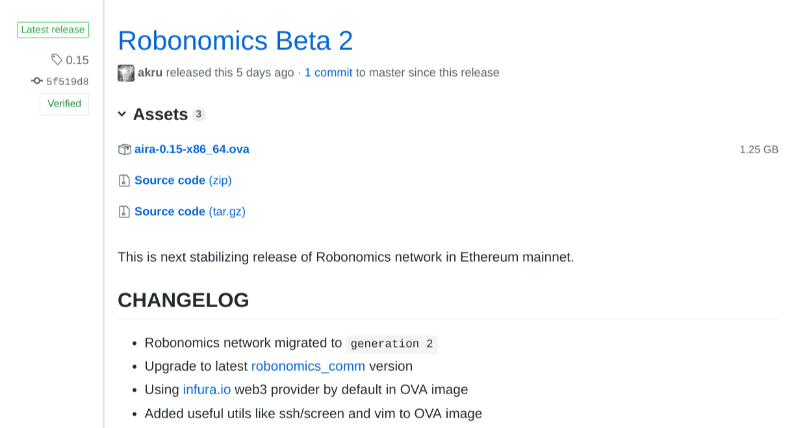
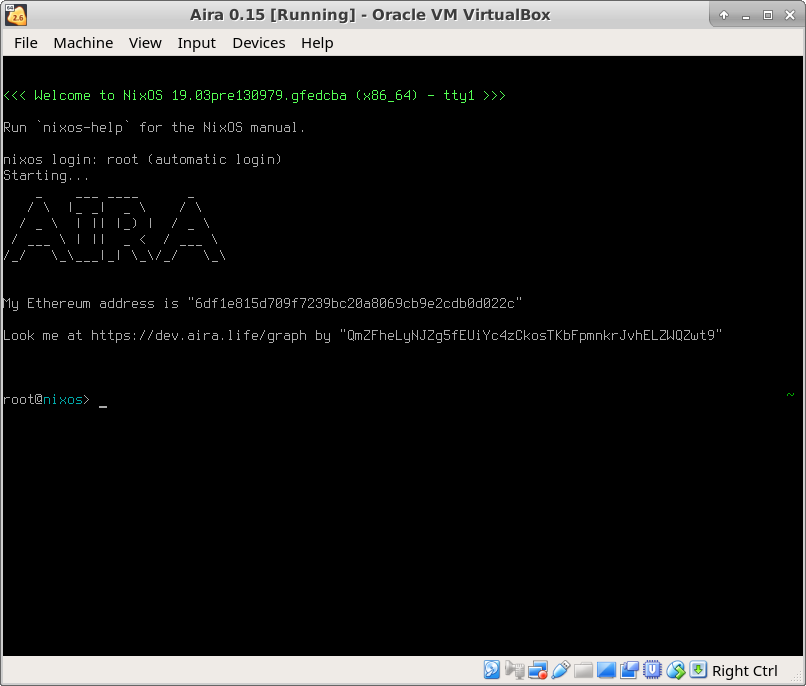

Getting Started
===============

.. image:: img/3.png
   :alt: AIRA logo
   :align: center
   :scale: 50 %

AIRA (Autonomous Intelligent Robot Agent) project implements the standard of economic interaction between human-robot and robot-robot via liability smart contract. AIRA makes it possible to connect a variety of different robots to the market of robot liabilities existing on Ethereum for the direct sale of data from robot sensors, ordering of logistics services, and organization ordering of personalized products at fully automated enterprises.

Useful links
------------

* `AIRA's official site <https://aira.life/>`_
* `The Team <https://aira.life/team>`_
* `Robonomics Network <https://robonomics.network/en/>`_

Quick Start
-----------

The first thing to do is to get the last image of AIRA. You can find it `here <https://github.com/airalab/aira/releases>`_.

Another option is to build the image from the source:

.. code-block:: bash

    $ git clone https://github.com/airalab/airapkgs
    $ cd airapkgs
    $ nix build -f nixos/release-aira.nix ova_image

After this the image could be found in the ``result`` folder.

AIRA is distributed as virtual machine image. To launch the client you need to import .ova file to VirtualBox. You can use a convenient ``Ctrl+I`` shortcut.

It's recommended to set:

* RAM to 2Gb at least
* At least 40 Gb SSD

When the image is imported, launch the machine.

To make your work with the machine easier, try to `connect via SSH <aira_in_depth/Connecting_via_SSh.html>`_.

There are some helpful commands on `FAQ <faq.html>`_ page.
