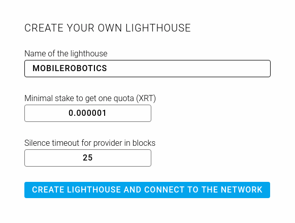
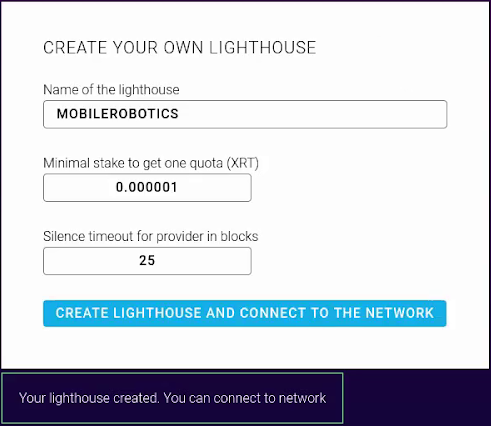
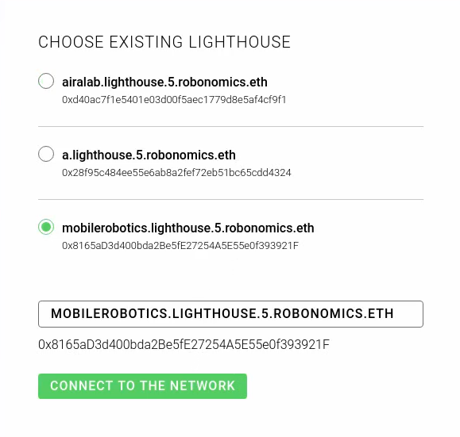
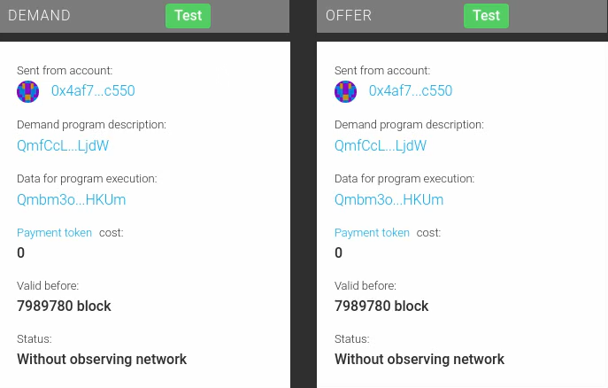
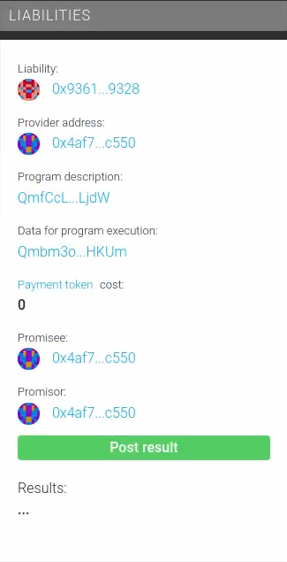

Become a Provider
=================

This page describes how to create a lighthouse and become a provider in the Robonomics network.

Prepare an address
------------------

First of all, an Ethereum address is required. You must have access to a private key of the address. In case you don't have one, below are steps to create an address via `Parity <https://www.parity.io/ethereum/>`_.

.. code-block:: bash

    $ sudo snap install parity
    $ parity.ethkey generate random
    secret:  15abe71557c07b69537bbe4352ed10a057be89037c69d4b35556112519911539
    public: 38b800bfd90d486c78c646da79bb94b9d038aca8aad221062ce1b148df7764bfef02f6b3cf931786b6997540b798ea226ae60bd201c222d8f702e408a1a5cbff
    address: c531fa8f141493df3da264a864bdcbec19695b4c

The ``secret`` field is a private key, you'll need it to run the provider client. Save it to a file:

.. code-block:: bash

    $ echo '0x15abe71557c07b69537bbe4352ed10a057be89037c69d4b35556112519911539' > private.key

The next step is to deposit some ethers and XRT tokens to the address which is held in the ``address`` field.

Create a lighthouse
-------------------

Go to the lighthouse `dapp <https://robonomics.network/lighthouse/#/>`_ and fill in a name in the right side:

Click on the `Create lighthouse and connect to the network` button and sign a transaction. After a while you should see:

Now it's time to put a stake. Select the new lighthouse and click `Connect to the network`:

On this page in the `Provider` section click the `Approve` button, sign a transaction. When it's mined click the `Refill` button and do the same.

Install the client
------------------

You must install `robonomics-tools <https://github.com/airalab/robonomics-tools>`_ at least 0.4.2. version. You can build from the source or do the following steps:

.. note::

    Make sure you have Nix and Stack installed:

    .. code-block:: bash

        $ curl -sSL https://get.haskellstack.org/ | sh
        $ curl https://nixos.org/nix/install | sh

* Setup Airalab binary cache at `https://aira.cachix.org/ <https://aira.cachix.org/>`_
* Import Airalab channel:

    .. code-block:: bash

        $ nix-channel --add http://aira.life/channels/aira-unstable/ aira
        $ nix-channel --update

* Install from the binary cache:

    .. code-block:: bash

        $ nix-env -iA aira.robonomics-tools

* Run the client:

    .. code-block:: bash

        $ xrtd --lighthouse mobilerobotics.lighthouse.5.robonomics.eth --private $(cat private.key)

.. hint::

    Get familiar with the `xrtd` options via ``xrtd --help``

Test the provider
-----------------

To test your provider go again to the lighthouse `dapp <https://dapp.robonomics.network/#/lighthouse/>`_ and connect to the just created lighthouse.

At the bottom you should see the `TEST LIGHTHOUSE` section.

Click on the `Demand` button and then on the `Offer` one. You should see something similar to:

Don't forget to sign every message with the MetaMask extension.

Finally you should see a new liability contract created:

