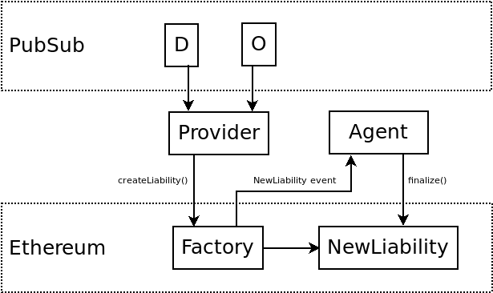
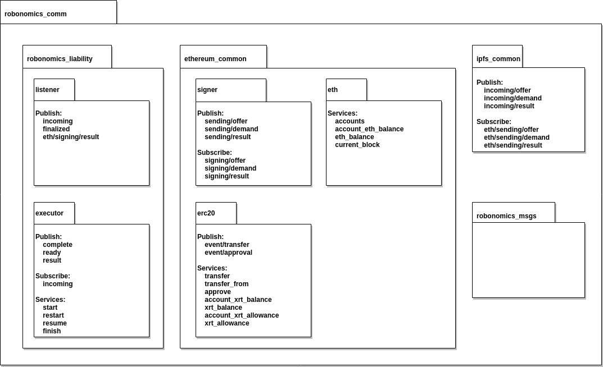

How It Works
============

In this section we will discuss the Robonomics Network scenario.

Robonomics Network uses IPFS PubSub channels for messaging. There are three types of messages: Demand, Offer, Result.

**Below there is the specification for a Demand message:**

=============== ============================================================== ================================================ ================================================
     Field                                   Type                                                Description                                        Example
=============== ============================================================== ================================================ ================================================
  model          :ref:`ipfs_common/Multihash <IPFS-Common-Multihash.msg>`       CPS behavioral model Identifier                  QmfXHZ2YkNC5vRjp1oAaRoDHD8H3zZznfhBPasTu348eWC
  objective      :ref:`ipfs_common/Multihash <IPFS-Common-Multihash.msg>`       CPS behavioral model parameters in rosbag file   QmUo3vvSXZPQaQWjb3cH3qQo1hc8vAUqNnqbdVABbSLb6r
  token          :ref:`ethereum_common/Address <Ethereum-common-Address.msg>`   Operational token address                        0xbD949595eE52346c225a19724084cE517B2cB735
  cost           :ref:`ethereum_common/UInt256 <Ethereum-common-UInt256.msg>`   CPS behavioral model implementation cost         1
  lighthouse     :ref:`ethereum_common/Address <Ethereum-common-Address.msg>`   Lighthouse address                               0xa1b60ED40E5A68184b3ce4f7bEf31521A57eD2dB1
  validator      :ref:`ethereum_common/Address <Ethereum-common-Address.msg>`   Observing network address                        0x0000000000000000000000000000000000000000
  validatorFee   :ref:`ethereum_common/UInt256 <Ethereum-common-UInt256.msg>`   Observing network commission                     0
  deadline       :ref:`ethereum_common/UInt256 <Ethereum-common-UInt256.msg>`   Deadline block number                            6393332
  sender         :ref:`ethereum_common/Address <Ethereum-common-Address.msg>`   Message sender address                           0x0000000000000000000000000000000000000000
  signature      std_msgs/UInt8[]                                               Sender's digital signature                       0x23bc...c617
=============== ============================================================== ================================================ ================================================

An Offer message has the same fields but instead of ``validatorFee`` there is a ``lighthouseFee`` field. This field determines the amount of fee for a lighthouse.

Now let's have a look at the following diagram and walk step by step from the moment of publishing messages to a liability finalization.

A liability contract is created only if the following fields match: ``model``, ``objective``, ``token``, ``cost``. A provider of Robonomics Network watches every message and finds those ones that have a match.
After the match is found the provider calls ``createLiability(demand, offer)`` method from the contract factory where ``demand`` and ``offer`` are serialized.

Below is the package diagram for the Robonomics communication stack:

The factory deserializes arguments and recovers *promisee* and *promisor* addresses from signatures.

Next step is token transfer. The factory transfers **cost** tokens from the *promisee* address and **validatorFee** and **lighthouseFee** from the *promisor* address to the new liability address.

.. note::

    You should approve sufficient amount of tokens for the factory.

.. note::

    It's not required to approve tokens from the *promisor* address if fees are null.

Now the factory emits a NewLiability event with the liability address. An agent gets the address, reads fields, perform a task and at the same time writes a log file in rosbag format.

When the work is done the agent sends a Result message with the following fields: hash of the rosbag file, a success flag, a signature. If the **validator** field is not null it means that only validator is able to finalize the liability.

After the successful liability finalization the agent gets **cost** tokens. Otherwise, the *promisee* gets tokens back.
